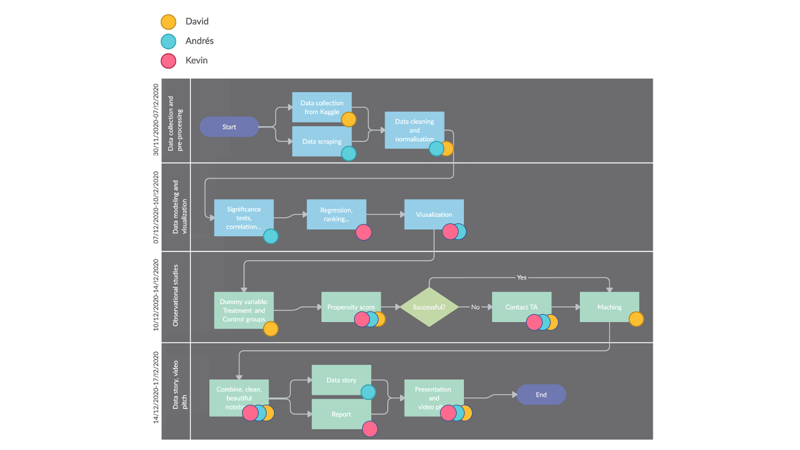

# Where to take my talents to - a world happiness analysis

## Abstract

In the summer of 2010, in a much anticipated decision, NBA all-star Lebron James announced to the world that he would be taking his talents to South Beach to join the Miami Heat. This makes us question - is Miami, Florida really the best place for one to take their talents to? In this report, we analyze the World Happiness Report dataset to determine the top destinations around the world in terms of overall happiness. The happiness scores utilize data from the Gallup World Poll which collects answers in a Candril ladder survey format. Respondents are asked to think of a ladder with the best possible life for them being a 10, and the worst being a 0 and to rate their current lives on such scale. The dataset consists of over 150 countries from the years 2015 to 2020, consisting of features such as life expectancy, economic product, corruption and much more. While our travel decisions may not be as complicated as Lebron James’, we hope to analyze the dataset to effectively assess the past, current and future well-being of nations around the world.

## Research questions

* What factors influence the happiness score?
* Which factors are considered highly significant?
* Are certain features more correlated than others?
* Are certain continents/areas around the world more happier than others? In other words, are neighbouring countries also happy?
* Did any countries experience a significant increase/decrease in happiness from 2015 to 2020?
* Are there any outliers in happiness during a specific year for a certain country? If so, what could explain this?
* What should political leaders of countries with low happiness focus to improve?
* Does the impact of COVID have a large impact on happiness during 2020? Do we expect to observe all countries indicating a decrease in happiness?

## Dataset(s)

The proposed dataset is collected from open source platform [Kaggle](https://www.kaggle.com/mathurinache/world-happiness-report). The link, editors and citation can all be found below. The dataset consists of over 150 countries with roughly 10 - 20 features depending on the year of interest. Some countries are not represented in certain years. For example, from 2015 to 2016 we observe 159 to 156 rows in the dataset, respectively. Furthermore, pre-processing the data is necessary to address entries of “N/A” or 0. Similar analysis will be performed for the [COVID dataset](https://www.kaggle.com/imdevskp/corona-virus-report) per country. Both datasets are in .csv format and thus easily accessible using pandas. Finally, data for the total population in order to compute the number of COVID cases per population will be obtained by web scraping from one of the sources on [Wikipedia](https://en.wikipedia.org/wiki/COVID-19_pandemic_by_country_and_territory) or [Worldometers](https://www.worldometers.info/world-population/population-by-country/).

Links:

https://www.kaggle.com/mathurinache/world-happiness-report
https://www.kaggle.com/imdevskp/corona-virus-report
https://www.worldometers.info/coronavirus/
https://www.worldometers.info/world-population/population-by-country/
https://en.wikipedia.org/wiki/COVID-19_pandemic_by_country_and_territory

Editors:
John Helliwell, Richard Layard, Jeffrey D. Sachs, and Jan Emmanuel De Neve, Co-Editors; Lara Aknin, Haifang Huang and Shun Wang, Associate Editors; and Sharon Paculor, Production Editor
 
Citation:
Helliwell, John F., Richard Layard, Jeffrey Sachs, and Jan-Emmanuel De Neve, eds. 2020. World Happiness Report 2020. New York: Sustainable Development Solutions Network

## Methods

 Data Collection:

* Seeing what information we have each year, since not all years have the same data. For example, either the number of countries or the number of features changes each year.
* Dealing with missing values.
* Propose a method to merge data of different years or between the happiness and COVID datasets.
 
 Significance Test: 

* Look at p-values for specific features and determine its significance.
 
 Correlation: 

* Between features and target (happiness score).
 
 Regression: 

* Study what features are most related to happiness, the impact of the coronavirus on the happiness of countries.
* We study the evolution of the characteristics that are most correlated with happiness, over the years. 
* Making regression studies by geographical areas, i.e. by groups of countries, not by countries, to see if the countries in a certain area have similar behaviour.
 
 Ranking: 

* Make a ranking of the happiest countries, and the countries impacted the greatest by coronavirus.
* Seeing in which features the countries have obtained worse scores, and analyse if the respective governments could do something about it.
 
 Visualization: 

* Use graphics that clearly show the contribution of characteristics to the happiness score in the happiest countries, the distribution of happiness score by region.
 
 Matching: 

* Does money buy happiness?
* We create a dummy variable for treatment and control groups. Where countries that have a GDP per capita greater than $ X are assigned 1, and 0 otherwise.
* Calculate propensity score for each group and apply matching.

## Timeline

<table>
  <tr>
   <td><strong>Deliverable</strong>
   </td>
   <td><strong>Deadline</strong>
   </td>
  </tr>
  <tr>
   <td>Finish proposal and submit
   </td>
   <td>Nov. 27, 2020
   </td>
  </tr>
  <tr>
   <td>Await for feedback, make any modifications if necessary
   </td>
   <td>Dec. 4, 2020
   </td>
  </tr>
  <tr>
   <td>Preprocess data, read in dataset, split up and assign specific tasks
   </td>
   <td>Dec. 7, 2020
   </td>
  </tr>
  <tr>
   <td>Combine completed tasks, complete discussion questions, draft report and presentation (if time permits, relate this with a covid dataset)
   </td>
   <td>Dec. 17, 2020
   </td>
  </tr>
  <tr>
   <td>Presentation
   </td>
   <td>Dec. 18, 2020
   </td>
  </tr>
</table>

## Organization

- [ ] Data Collection and scrapping
- [ ] Data Processing
- [ ] Data modeling and visualization: significance test, correlation, regression, ranking, etc.
- [ ] Propensity score matching: treatment and control
- [ ] Data story: interpretation, map visualization, etc.
- [ ] Report
- [ ] Presentation and video pitch

## Questions

1. Is this project proposal adequate in terms of technical depth and breadth related to the course?
2. Is our dataset sufficient?
3. Does it make sense to potentially compare it with a COVID dataset to determine whether the virus had an impact on country happiness for 2020?
4. Is it ok if we add more datasets in the future?
5. Is the matching method correct by assigning treatment as countries that are rich (GDP per capita greater than $ X)?
